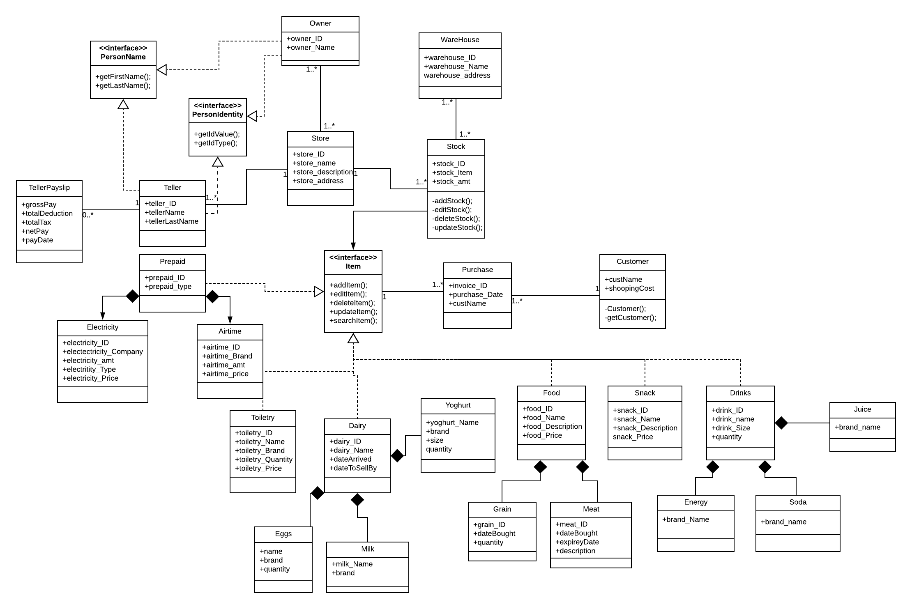

#Spaza Automation System

Domain: Spaza Automation System
 
215113837 Luzuko Ndlebe
   
We all love our neighboring spaza/small businesses and we always go to them when we want to buy all the little stuff that we can’t really go to a supermarket to buy. Even though it is just a spaza shop it has a whole lot of customers in the community that depend and buy from them.  With that thought I always wondered how they manage to keep track off all the stock they sell and how much stock that comes in. 
When I asked one of the shop keepers, he said they just buy enough and hope that it will runout before it expires and they never know which stock is too much or running out without having to physically counting the items.
With this system I want to bring a more efficient working environment for the shop keeper where he’ll be able to see how much he’s sold, and also receiving notifications when there has been stock that is about to be depleted

